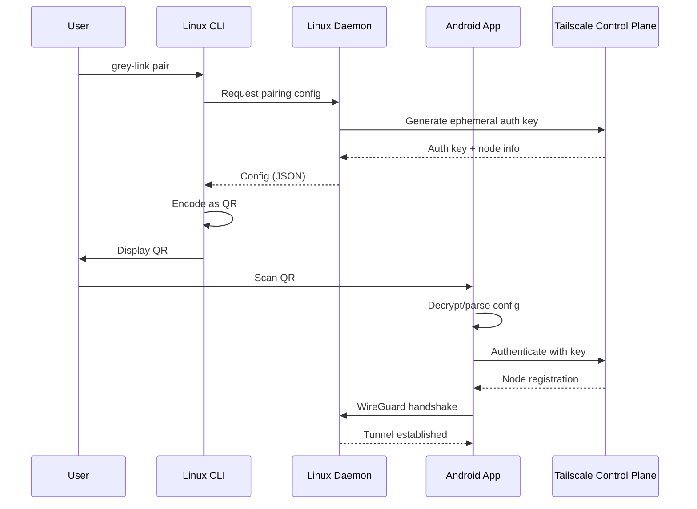

# Grey-Link MVP 1.0 — Architecture & Design Specification

**Version**: 1.0  
**Date**: 2026-02-01  
**Status**: Draft

---

## Mission

Grey-Link provides an invisible, persistent TCP/IP tunnel between Android and Linux devices. It acts as a "dumb cable"—applications on both ends communicate without awareness of the underlying network complexity.

---

## Core Principles

### The Lobotomy Pattern

Transport logic is strictly isolated from the application layer. The app layer has no knowledge of:

- Network state
- Connection method (WireGuard, DERP relay, direct)
- Authentication mechanics
- Reconnection logic

### VPN Coexistence

Grey-Link uses **embedded tsnet** (not Android VpnService) to coexist with corporate/privacy VPNs. The tunnel operates at the app level, not system level.

### Self-Healing

Connections automatically recover from:

- Network transitions (Wi-Fi ↔ LTE)
- Device reboots
- Sleep/wake cycles
- Temporary network loss

---

## Architecture

### High-Level Flow

```
┌─────────────────────────────────────────────────────────────────┐
│  Android                                                         │
│  ┌─────────────────┐    ┌────────────────────────────────────┐  │
│  │ Grey-Link App   │───▶│ greylink-transport (Go/gomobile)   │  │
│  │ (Kotlin)        │    │ ├── tsnet.Server                   │  │
│  └─────────────────┘    │ ├── EncryptedSharedPreferences     │  │
│                         │ └── Connect() / Dial() / Listen()  │  │
│                         └────────────────────────────────────┘  │
│                                       │                          │
│                                       │ WireGuard (UDP)          │
│                                       ▼                          │
└─────────────────────────────────────────────────────────────────┘
                                        │
                                        │ (Via Tailscale/Headscale)
                                        ▼
┌─────────────────────────────────────────────────────────────────┐
│  Linux                                                           │
│  ┌────────────────────────────────────────────────────────────┐ │
│  │ grey-link-daemon (Go)                                       │ │
│  │ ├── tsnet.Server                                            │ │
│  │ ├── Auth key storage (keyring/encrypted file)               │ │
│  │ └── Local TCP listener                                      │ │
│  └────────────────────────────────────────────────────────────┘ │
│                         │                                        │
│  ┌─────────────────┐   │                                        │
│  │ grey-link CLI   │───┘                                        │
│  │ pair / status   │                                            │
│  └─────────────────┘                                            │
└─────────────────────────────────────────────────────────────────┘
```

### Why No VpnService?

| Approach | Problem |
|----------|---------|
| VpnService | Android allows only ONE VPN—conflicts with corporate/privacy VPNs |
| Embedded tsnet | Uses own TCP/IP stack—coexists with any VPN |

tsnet's userspace network stack bypasses Android's routing. External VPNs only see encrypted WireGuard UDP packets.

---

## Component Specifications

### Linux Daemon (`grey-link-daemon`)

| Aspect | Specification |
|--------|---------------|
| Language | Go 1.22+ |
| Network | Embedded tsnet.Server |
| Persistence | systemd with Restart=always |
| State Storage | Encrypted file or system keyring |
| TCP Port | 9999 (configurable) |

### Linux CLI (`grey-link`)

| Command | Function |
|---------|----------|
| `grey-link daemon` | Start/stop daemon |
| `grey-link pair` | Generate QR code for Android pairing |
| `grey-link status` | Show connection state |

### Android Transport Library (`greylink-transport`)

| Aspect | Specification |
|--------|---------------|
| Language | Go 1.22+ via gomobile |
| Binding | .aar for Android |
| Storage | EncryptedSharedPreferences |

**Exported API**:

```go
func Connect(authKey string) error
func Dial(addr string) (net.Conn, error)
func Listen(port int) (net.Listener, error)
func GetStatus() string
func Close()
```

### Android App (`grey-link`)

| Aspect | Specification |
|--------|---------------|
| Language | Kotlin |
| Min SDK | 26 (Android 8.0) |
| Target SDK | 34 |
| Distribution | F-Droid only |
| Persistence | Foreground Service + WorkManager |

---

## Security Model

### State Encryption

| Platform | Mechanism |
|----------|-----------|
| Android | EncryptedSharedPreferences (backed by Android Keystore) |
| Linux | System keyring (libsecret) or file encrypted with user password |

### Auth Key Lifecycle

1. User creates auth key in Tailscale admin console
2. Key encoded in QR code by Linux CLI
3. Android scans QR → stores encrypted
4. Key auto-expires per Tailscale policy (recommend 90 days)

### Zero Trust

- All traffic encrypted (WireGuard)
- No credentials in logs
- State encrypted at rest
- No network trust assumptions

---

## Pairing Flow



---

## Status States

| State | Description |
|-------|-------------|
| `UNPAIRED` | No auth key stored |
| `CONNECTING` | tsnet initializing |
| `CONNECTED` | Tunnel active |
| `RECONNECTING` | Recovering from network change |
| `ERROR` | Connection failed (see logs) |

---

## Constraints

### Must Have

- Works without VPN permission
- Coexists with corporate VPNs
- Survives reboots
- Auto-reconnects

### Must NOT Have

- System-wide traffic routing
- VPN permission modal
- Play Store distribution
- Root requirement

---

## Deferred (Post-MVP)

- Multi-connection multiplexing
- File transfer
- Clipboard sync
- Remote input
- Headscale support
- iOS client

---

## Dependencies

| Dependency | Version | Purpose |
|------------|---------|---------|
| Go | 1.22+ | netlinkrib fix for Android |
| tsnet | latest | Embedded Tailscale |
| gomobile | latest | Android binding |
| Kotlin | 1.9+ | Android app |
| AndroidX Security | latest | EncryptedSharedPreferences |
